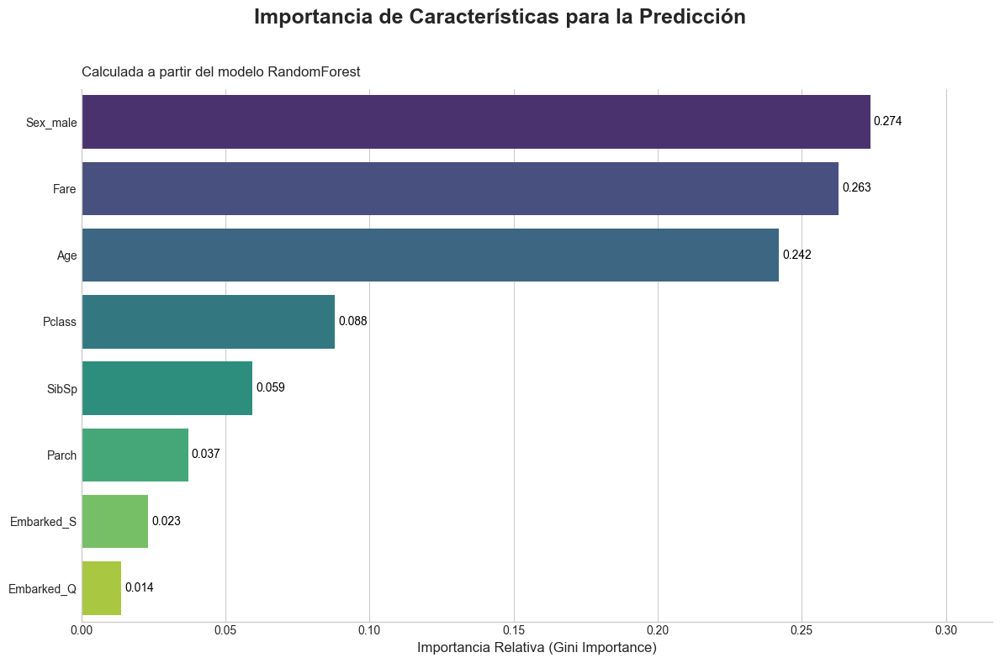
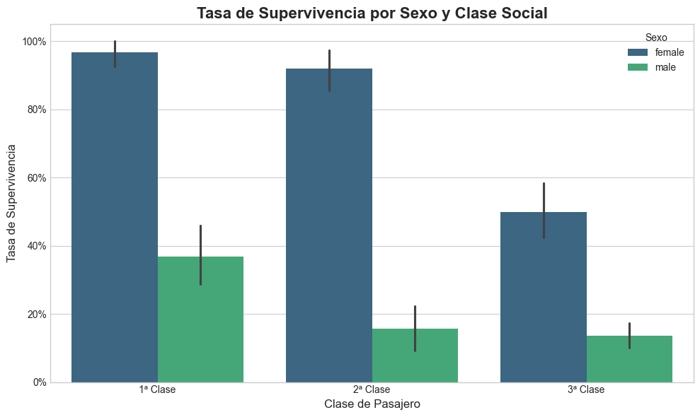

# 🚢 Predicción de Supervivencia en el Titanic y Análisis Interpretativo


## 🎯 Descripción del Proyecto

Este proyecto va más allá de la simple predicción de supervivencia en el Titanic. Se realiza un análisis profundo para responder a la pregunta: **¿Qué características personales y sociales influyeron de manera más decisiva en las probabilidades de supervivencia durante el naufragio?**

Utilizando un modelo de Machine Learning (Random Forest), no solo se construye un clasificador con una **precisión final del 82.09%**, sino que el foco principal es la **interpretación de los resultados**. El análisis desentraña cómo variables como el sexo, la edad y la clase social no solo influyeron de forma aislada, sino que su interacción determinó quién vivió y quién murió, confirmando que la tragedia no fue un ecualizador social.

## 💡 Hallazgos Principales

El análisis revela una clara jerarquía de supervivencia, donde el destino de un pasajero estaba fuertemente predeterminado por sus características demográficas:

1️⃣ **El Sexo como Factor Determinante:** Ser mujer multiplicaba las probabilidades de supervivencia, confirmando la aplicación del código de conducta marítimo "mujeres y niños primero".

2️⃣ **La Edad como Segundo Pilar del Rescate:** Se priorizó de forma explícita a los niños, resultando en una alta tasa de supervivencia en comparación con los adultos.

3️⃣ **La Clase Social como Modulador Implacable:** El privilegio de ser mujer o niño se magnificaba enormemente en la 1ª y 2ª Clase y se atenuaba drásticamente en la 3ª. Para los hombres, la clase alta ofrecía la única esperanza tangible de supervivencia.

## 📈 Visualizaciones Destacadas

#### Importancia de las Características según el Modelo
Esta gráfica muestra qué variables consideró más importantes el modelo Random Forest para tomar sus decisiones. El sexo (`Sex_male`) es, con diferencia, el factor más influyente.



#### Tasa de Supervivencia por Sexo y Clase Social
Esta visualización demuestra la interacción crítica entre el género y la clase social. Mientras que las mujeres de 1ª y 2ª clase tenían una supervivencia superior al 90%, las de 3ª clase apenas alcanzaban el 50%.



## ⚙️ Características Técnicas

*   **Modelado Predictivo:** Implementación de un clasificador `RandomForestClassifier` optimizado para una precisión del **82.09%** en el conjunto de prueba.
*   **Ingeniería de Características:** Estrategias de imputación robustas para manejar valores ausentes, incluyendo el uso de la mediana para la tarifa (`Fare`) y la generación de valores a partir de una distribución normal estimada para la edad (`Age`).
*   **Optimización de Hiperparámetros:** Proceso riguroso en dos fases utilizando `GridSearchCV` y un análisis visual con el `Out-of-Bag (OOB) score` para encontrar la combinación óptima de `n_estimators` y `max_depth`.
*   **Análisis Interpretativo:** Uso de la importancia de Gini para identificar las variables más predictivas y análisis de su impacto a través de visualizaciones detalladas.
*   **Informe Completo:** El proyecto está documentado en un **informe académico de 16 páginas** que detalla la metodología, la implementación y las conclusiones.

## 💻 Tecnologías Utilizadas

*   **Lenguaje:** Python 3
*   **Librerías Principales:**
    *   Pandas
    *   NumPy
    *   Scikit-learn
    *   Matplotlib
    *   Seaborn
*   **Entorno:** Jupyter Notebook

## 📂 Estructura del Repositorio

```
.
├── titanic_analysis.ipynb         # 📓 Notebook con todo el código del análisis y modelado.
├── informe_proyecto_titanic.pdf   # 📄 Informe detallado del proyecto.
├── requirements.txt               # 📋 Archivo con las dependencias para replicar el entorno.
└── README.md                      # ℹ️ Este archivo.```
```
## 🚀 Cómo Replicar el Análisis

Para ejecutar este proyecto en tu máquina local, sigue estos pasos:

1.  **Clona el repositorio:**
    ```bash
    git clone https://github.com/pablotgp/Titanic-Socioeconomic-Survival-Analysis.git
    cd Titanic-Socioeconomic-Survival-Analysis
    ```

2.  **Crea un entorno virtual (recomendado):**
    ```bash
    python -m venv venv
    source venv/bin/activate  # En Windows usa `venv\Scripts\activate`
    ```

3.  **Instala las dependencias:**
    ```bash
    pip install -r requirements.txt
    ```

4.  **Inicia Jupyter Notebook:**
    ```bash
    jupyter notebook
    ```
    Abre el archivo `titanic_analysis.ipynb` y ejecuta las celdas.

## 👨‍💻 Autor

*   **Pablo Antonio García Pastor**
*   [LinkedIn](https://www.linkedin.com/in/pablogp-ai)
*   [Correo Electrónico](mailto:pablotgp2002@gmail.com)
